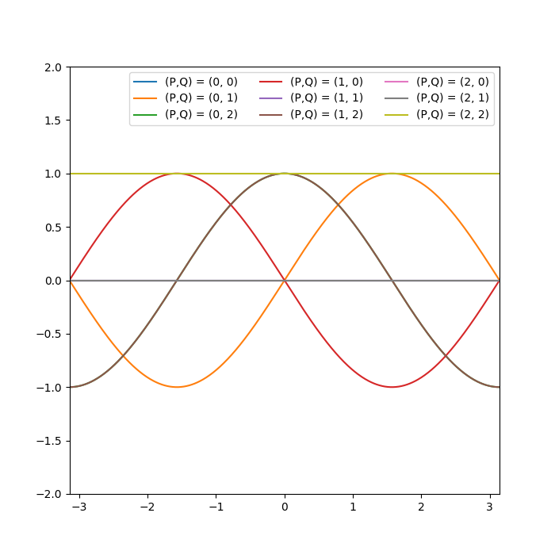

# 2 向量和矩阵

## 2-1 旋转矩阵

运行以下的代码：

```python
import matplotlib.pyplot as plt
import numpy as np

plt.figure(figsize=(5,5))

def R(t):
    return np.array([[np.cos(t),np.sin(t)],[-np.sin(t),np.cos(t)]])

O = np.array([0,0])
v1 = np.array([1,2])
v2 = np.array([2,3])

plt.axhline(0)
plt.axvline(0)

plt.xlim(-5,5)
plt.ylim(-5,5)

plt.grid()
plt.xticks(np.arange(-5,5,1))
plt.yticks(np.arange(-5,5,1))

plt.quiver(*O,*v1,color='b',width=0.003,angles='xy',scale_units='xy',scale=1)
plt.quiver(*O,*v2,color='b',width=0.003,angles='xy',scale_units='xy',scale=1)

v1 = np.dot(R(np.pi/6),v1)
v2 = np.dot(R(np.pi/6),v2)

plt.quiver(*O,*v1,color='r',width=0.003,angles='xy',scale_units='xy',scale=1)
plt.quiver(*O,*v2,color='r',width=0.003,angles='xy',scale_units='xy',scale=1)

plt.show()
```

这个代码会把 $v_1,v_2$（图中的蓝色向量）变为 $R(\pi/6)v_1,R(\pi/6)v_2$（图中的红色向量）。可以得到这样的结果：


可见 $R(\theta)$ 的作用是将向量顺时针旋转 $\theta$ 角度。

## 2-2 矩阵指数

对于正规算子 $A$，设 $A$ 在某个标准正交基下化为 $\sum A_i|v\rang\lang v|$，则我们可以定义 $f(A)=\sum f(A_i)|v\rang\lang v|$。

严格按照定义的办法是做正交对角化，并求出特征值，然后进行计算。简便的办法是使用泰勒展开来近似计算 $e^{i\hat P}$ 的值。容易证明二者是等价的。

```python
import numpy as np

def Exp(A, step = 30):
    res = np.zeros_like(A)
    now = np.identity(A.shape[0])
    for i in range(step):
        res = res + now
        now = np.dot(now,A)/(i+1)
    return res

sigma_x = np.array([[0,1],[1,0]])
sigma_y = np.array([[0,-1j],[1j,0]])
sigma_z = np.array([[1,0],[0,-1]])

print("exp(i * sigma_x) =")
print(Exp(1j*sigma_x))
print("exp(i * sigma_y) =")
print(Exp(1j*sigma_y))
print("exp(i * sigma_z) = ")
print(Exp(1j*sigma_z))
```

运行结果为：

```
exp(i * sigma_x) =
[[0.54030231+0.j         0.        +0.84147098j]
 [0.        +0.84147098j 0.54030231+0.j        ]]
exp(i * sigma_y) =
[[ 0.54030231+0.j  0.84147098+0.j]
 [-0.84147098+0.j  0.54030231+0.j]]
exp(i * sigma_z) =
[[0.54030231+0.84147098j 0.        +0.j        ]
 [0.        +0.j         0.54030231-0.84147098j]]
```

注意到对于泡利矩阵均有 $(\hat P)^2=I$，因此

$$
e^{ix\hat P}=I\sum_{n=0}^{+\infty}\frac{(ix\hat P)^n}{n!}=\sum_{k=0}^{+\infty}\frac{(-1)^kx^{2k}}{(2k)!}+i\hat P\sum_{k=0}^{+\infty}\frac{(-1)^kx^{2k+1}}{(2k+1)!}
$$

又有

$$
\sin x=\sum_{k=0}^{+\infty}\frac{(-1)^kx^{2k+1}}{(2k+1)!}\\
\cos x=\sum_{k=0}^{+\infty}\frac{(-1)^kx^{2k}}{(2k)!}
$$

则 $e^{ix\hat P}=\cos(x)I+i\sin(x)\hat P$。在上面的程序中添加几行便可验证这一事实：

```python
print("cos(1) + i * sin(1) * sigma_x = ")
print(np.cos(1) * np.identity(2) + 1j * np.sin(1) * sigma_x)
print("cos(1) + i * sin(1) * sigma_y = ")
print(np.cos(1) * np.identity(2) + 1j * np.sin(1) * sigma_y)
print("cos(1) + i * sin(1) * sigma_z = ")
print(np.cos(1) * np.identity(2) + 1j * np.sin(1) * sigma_z)
```

运行结果：

```
cos(1) + i * sin(1) * sigma_x =
[[0.54030231+0.j         0.        +0.84147098j]
 [0.        +0.84147098j 0.54030231+0.j        ]]
cos(1) + i * sin(1) * sigma_y =
[[ 0.54030231+0.j  0.84147098+0.j]
 [-0.84147098+0.j  0.54030231+0.j]]
cos(1) + i * sin(1) * sigma_z =
[[0.54030231+0.84147098j 0.        +0.j        ]
 [0.        +0.j         0.54030231-0.84147098j]]
```

可以看到与前面的输出是一致的。

根据证明过程，只要 $P^2=I$，就有 $e^{ixP}=\cos(x)I+i\sin(x)P$。

## 2-3

运行如下的程序：

```python
import numpy as np
import matplotlib.pyplot as plt

sigma = [np.array([[0,1],[1,0]]),np.array([[0,-1j],[1j,0]]),np.array([[1,0],[0,-1]])]

def f(typeP,typeQ,theta):
    P = sigma[typeP]
    Q = sigma[typeQ]

    v = (np.cos(theta/2) * np.identity(2) + 1j * np.sin(theta/2) * P) @ np.array([1,0])
    return v.conj().T @ Q @ v

plt.figure(figsize=(7,7))
x = np.arange(-np.pi,np.pi,0.01)

for (P,Q) in [(0,0),(0,1),(0,2),(1,0),(1,1),(1,2),(2,0),(2,1),(2,2)]:
    y = np.array([f(P,Q,theta).real for theta in x])
    plt.plot(x,y,label = f"(P,Q) = {(P,Q)}")

plt.ylim(-2,2)
plt.xlim(-np.pi,np.pi)
plt.legend(loc = 'upper right',ncol = 3)
plt.show()
```

（事实上，由于泡利矩阵都是 Hermite 的，因此 $v^\dagger \hat{Q} v$ 总是实数）

输出的效果图为：



可以看到，有很多个图像重合了，且它们的图像与正弦、余弦函数很相似。实际上，有：

$$
\begin{aligned}
v^\dagger \hat{Q} v &= (\exp(i\theta/2\hat{P})v_0)^{\dagger}\times  \hat{Q}\times (\exp(i\theta/2\hat{P})v_0)\\
&=v_0^{\dagger}(\cos(\theta/2)I+i\sin(\theta/2)\hat{P})^{\dagger}\times \hat{Q}\times (\cos(\theta/2)I+i\sin(\theta/2)\hat{P})v_0\\
&=v_0^{\dagger}(\cos^2(\theta/2)\hat{Q} + i\cos(\theta/2)\sin(\theta/2)\hat{Q}\hat{P}-i\sin(\theta/2)\cos(\theta/2)\hat{P}^{\dagger}\hat{Q}+\sin^2(\theta/2)\hat{P}^{\dagger}\hat{Q}\hat{P})v_0
\end{aligned}
$$

对于泡利矩阵 $\hat{P}$，总有 $\hat{P}^{\dagger}=\hat{P}$，且 $\hat{P}\neq \hat{Q}$ 时有 $\hat{P}\hat{Q}=-\hat{Q}\hat{P}$，相等时有 $\hat{P}^2=I$，据此可以化简上式：

- $\hat{P}=\hat{Q}$ 时，上式可化为 $v_0^{\dagger}\hat{P}v_0=\begin{cases}0&,\hat P=\sigma_x,\sigma_y\\1&,\hat P=\sigma_z\end{cases}$
- $\hat P\neq \hat Q$ 时，上式化为 $v_0^{\dagger}(\cos(\theta)\hat Q+i\sin(\theta)\hat Q\hat P)v_0$，而 $\sigma_x,\sigma_y,\sigma_z$ 中的任意两个按顺序（即 $x,y,z$ 的顺序）的乘积等于虚数单位 $i$ 乘上剩下的一个，于是上式总会化为 $\cos(\theta)$ 或者 $\pm \sin(\theta)$，正负号取决于 $\hat P,\hat Q$ 的顺序

## 2-4

矩阵的张量积：$A\oplus B$ 可以表示为

$$
A \otimes B = \begin{bmatrix}
a_{11}B & \cdots & a_{1m}B \\
\vdots & \ddots & \vdots \\
a_{n1}B & \cdots & a_{nm}B
\end{bmatrix}
$$

其中 $A$ 是 $n\times m$ 矩阵。

实际上，考虑 $n$ 个 $2\times 2$ 的酉矩阵 $A_1,\cdots,A_n$，将 $A_1\oplus \cdots \oplus A_n$ 展开，可以发现其实际的含义就是对第 $i$ 位施加操作 $A_i$，可以简记为 $A_1A_2\cdots A_n$。

下面的程序朴素地模拟了题目要求的过程，时间复杂度是 $\Theta(n4^n)$ 左右，实际上可以做到 $\Theta(n2^n)$

```python
import numpy as np

def H(n):
    I = np.identity(2)
    X = np.array([[0,1],[1,0]])
    Z = np.array([[1,0],[0,-1]])

    res = np.zeros((2**n,2**n))

    for i in range(n):
        mat = np.identity(1)
        for j in range(n):
            if i == j :
                mat = np.kron(mat,Z)
            else :
                mat = np.kron(mat,I)
        res = res + mat

    for i in range(n-1):
        mat1 = np.identity(1)
        for j in range(n):
            if i == j :
                mat1 = np.kron(mat1,X)
            else :
                mat1 = np.kron(mat1,I)

        mat2 = np.identity(1)
        for j in range(n):
            if i + 1 == j :
                mat2 = np.kron(mat2,X)
            else :
                mat2 = np.kron(mat2,I)
        
        res = res + np.dot(mat1,mat2)

    return res

def main():
    n = int(input())
    mat = H(n)
    print(mat[0][0])

if __name__ == "__main__":
    main()
```

对于 $H$ 在 $(1,0,0,\cdots)$ 下的期望值，实际上可以简单计算得到其实际值恰好为 $n$。

## 2-5

列向量为 

$$
\begin{pmatrix}
0\\
0\\
\frac{1}{\sqrt{2}}\\
0\\
0\\
-\frac{1}{\sqrt{2}}\\
0\\
0\\
\end{pmatrix}
$$

## 2-6

袜，怎么还要重写，我先做后面的

# 3 导数与梯度下降

## 3-1

```python
import numpy as np

def derivative(f, x):
    dx = 1e-5
    y = f(x)
    res = np.ones_like(x)
    for i in range(len(x)):
        x[i] = x[i] + dx
        dy = f(x) - y
        res[i] = dy / dx
        x[i] = x[i] - dx

    return res

# test
x = np.array([1.0,2.0,3.0])
def func(x):
    return 3 * x[0] * x[0] * x[1] * np.sqrt(x[2])
print(derivative(func,x))
```

## 3-2

有 $f'(x)=A\cos(x+B)=A\sin(x+\frac{\pi}{2}+B)=f(x+\frac{\pi}{2})-C$

## 3-3

2-3 部分的解答已经给出了 $f(\theta)$ 的化简表达式

## 3-4

以下的代码取的是 $\hat{P_1}=X,\hat{P_2}=Z$，可以修改函数得到更多的情况

```python
import numpy as np
import tensorcircuit as tc

K = tc.set_backend("tensorflow")
def f(x):
    c = tc.Circuit(1)
    c.rx(0 , theta = x)
    return K.real(c.expectation_ps(z = [0]))

f_grad = K.grad(f)

x = K.convert_to_tensor(np.random.randn(1))
lr = 0.05
step = 100

for _ in range(step):
    g = f_grad(x)
    x = x - g * lr

print(f"min : theta = {x} f = {f(x)}")
```

# 4 测量

## 4-1

```python
import numpy as np
import tensorcircuit as tc

c = tc.Circuit(2)
c.h(0)
c.cx(0, 1)

print(c.expectation([tc.gates.z(), [0]], [tc.gates.z(), [1]]))
```

可以看到输出为 `(0.99999994+0j)`，说明两个 bit 正相关

## 4-2

运行以下代码：

```python
import numpy as np
import tensorcircuit as tc

c = tc.Circuit(2)
c.h(0)
c.cx(0, 1)

count = {}
for _ in range(10000):
    vec, _ = c.measure(0,1)
    vec = tuple(vec)
    if vec in count:
        count[vec] += 1
    else:
        count[vec] = 1

print(count)
```

输出为

```
{(0.0, 0.0): 5056, (1.0, 1.0): 4944}
```

即，出现了 $5056$ 次 $|00\rangle$，和 $4944$ 次 $|11\rangle$，和预期的 $5000:5000$ 有 $56$ 的偏差。

## 4-3

利用上述代码又分别测试了 $1000$ 次，$100000$ 次，得到的结果分别是 $540:460,49966:50034$，看上去当测量次数足够大的时候误差次数并不随测量次数也变大，当然较小的时候还是比较接近 $1:1$。