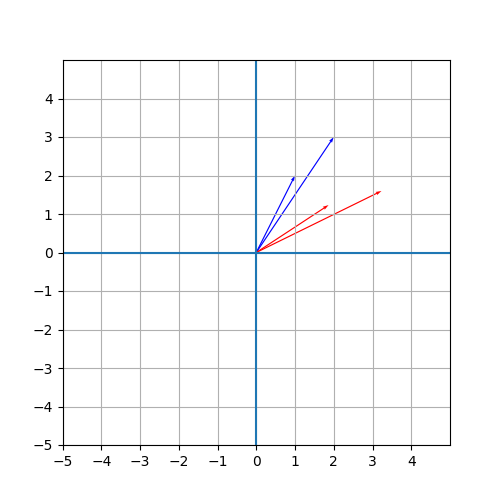

# 2 向量和矩阵

## 2-1 旋转矩阵

运行以下的代码：

```python
import matplotlib.pyplot as plt
import numpy as np

plt.figure(figsize=(5,5))

def R(t):
    return np.array([[np.cos(t),np.sin(t)],[-np.sin(t),np.cos(t)]])

O = np.array([0,0])
v1 = np.array([1,2])
v2 = np.array([2,3])

plt.axhline(0)
plt.axvline(0)

plt.xlim(-5,5)
plt.ylim(-5,5)

plt.grid()
plt.xticks(np.arange(-5,5,1))
plt.yticks(np.arange(-5,5,1))

plt.quiver(*O,*v1,color='b',width=0.003,angles='xy',scale_units='xy',scale=1)
plt.quiver(*O,*v2,color='b',width=0.003,angles='xy',scale_units='xy',scale=1)

v1 = np.dot(R(np.pi/6),v1)
v2 = np.dot(R(np.pi/6),v2)

plt.quiver(*O,*v1,color='r',width=0.003,angles='xy',scale_units='xy',scale=1)
plt.quiver(*O,*v2,color='r',width=0.003,angles='xy',scale_units='xy',scale=1)

plt.show()
```

这个代码会把 $v_1,v_2$（图中的蓝色向量）变为 $R(\pi/6)v_1,R(\pi/6)v_2$（图中的红色向量）。可以得到这样的结果：



可见 $R(\theta)$ 的作用是将向量顺时针旋转 $\theta$ 角度。

## 2-2 矩阵指数

对于正规算子 $A$，设 $A$ 在某个标准正交基下化为 $\sum A_i|v\rang\lang v|$，则我们可以定义 $f(A)=\sum f(A_i)|v\rang\lang v|$。

严格按照定义的办法是做正交对角化，并求出特征值，然后进行计算。简便的办法是使用泰勒展开来近似计算 $e^{i\hat P}$ 的值。容易证明二者是等价的。

```python
import numpy as np

def Exp(A, step = 30):
    res = np.zeros_like(A)
    now = np.identity(A.shape[0])
    for i in range(step):
        res = res + now
        now = np.dot(now,A)/(i+1)
    return res

sigma_x = np.array([[0,1],[1,0]])
sigma_y = np.array([[0,-1j],[1j,0]])
sigma_z = np.array([[1,0],[0,-1]])

print("exp(i * sigma_x) =")
print(Exp(1j*sigma_x))
print("exp(i * sigma_y) =")
print(Exp(1j*sigma_y))
print("exp(i * sigma_z) = ")
print(Exp(1j*sigma_z))
```

运行结果为：

```
exp(i * sigma_x) =
[[0.54030231+0.j         0.        +0.84147098j]
 [0.        +0.84147098j 0.54030231+0.j        ]]
exp(i * sigma_y) =
[[ 0.54030231+0.j  0.84147098+0.j]
 [-0.84147098+0.j  0.54030231+0.j]]
exp(i * sigma_z) =
[[0.54030231+0.84147098j 0.        +0.j        ]
 [0.        +0.j         0.54030231-0.84147098j]]
```

注意到对于泡利矩阵均有 $(\hat P)^2=I$，因此

$$
e^{ix\hat P}=I\sum_{n=0}^{+\infty}\frac{(ix\hat P)^n}{n!}=\sum_{k=0}^{+\infty}\frac{(-1)^kx^{2k}}{(2k)!}+i\hat P\sum_{k=0}^{+\infty}\frac{(-1)^kx^{2k+1}}{(2k+1)!}
$$

又有

$$
\sin x=\sum_{k=0}^{+\infty}\frac{(-1)^kx^{2k+1}}{(2k+1)!}\\
\cos x=\sum_{k=0}^{+\infty}\frac{(-1)^kx^{2k}}{(2k)!}
$$

则 $e^{ix\hat P}=\cos(x)I+i\sin(x)\hat P$。在上面的程序中添加几行便可验证这一事实：

```python
print("cos(1) + i * sin(1) * sigma_x = ")
print(np.cos(1) + 1j * np.sin(1) * sigma_x)
print("cos(1) + i * sin(1) * sigma_y = ")
print(np.cos(1) + 1j * np.sin(1) * sigma_y)
print("cos(1) + i * sin(1) * sigma_z = ")
print(np.cos(1) + 1j * np.sin(1) * sigma_z)
```

运行结果：

```
cos(1) + i * sin(1) * sigma_x =
[[0.54030231+0.j         0.54030231+0.84147098j]
 [0.54030231+0.84147098j 0.54030231+0.j        ]]
cos(1) + i * sin(1) * sigma_y =
[[ 0.54030231+0.j  1.38177329+0.j]
 [-0.30116868+0.j  0.54030231+0.j]]
cos(1) + i * sin(1) * sigma_z =
[[0.54030231+0.84147098j 0.54030231+0.j        ]
 [0.54030231+0.j         0.54030231-0.84147098j]]
```

可以看到与前面的输出是一致的。